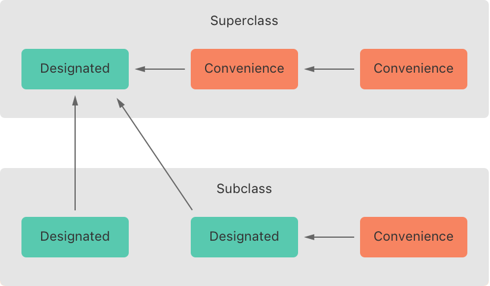
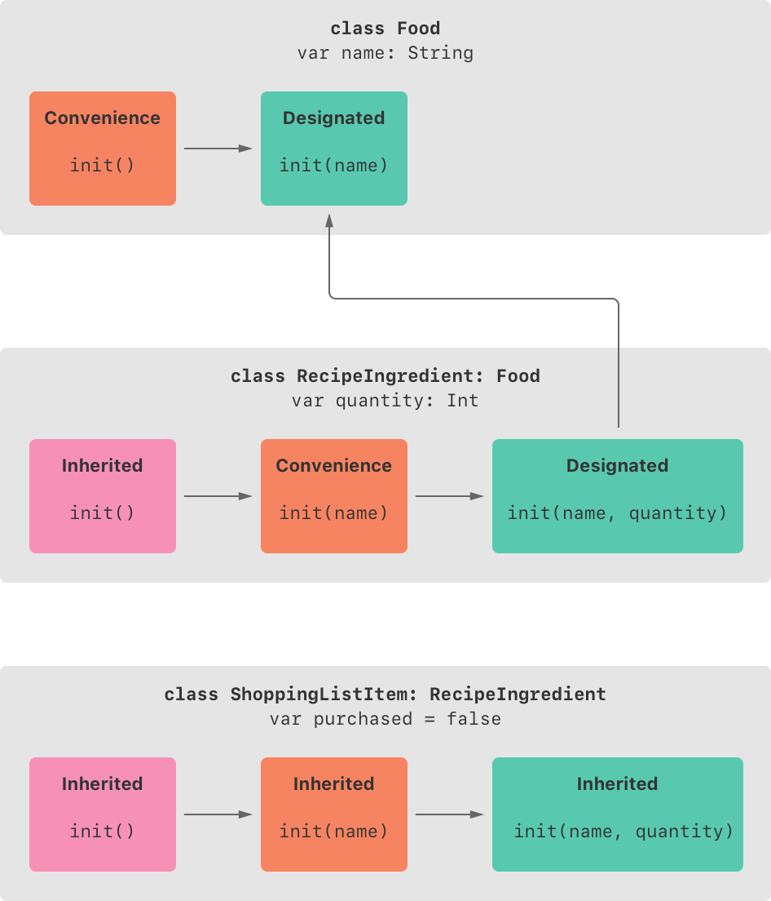

Swift v5.7 | [Swift versions](find-my-swift-version.md) | [Swift.org](https://docs.swift.org).

Taken from the [official Swift documentation](https://docs.swift.org/swift-book/LanguageGuide/TheBasics.html).


👉 You can [view this document in Xcode](https://github.com/MatthewpHarding/SWIFTDOCS-14-initialization/archive/refs/heads/main.zip) to run and edit each example.
## Run This File In Xcode

**Step 1:** Clone this repo or [download the files](https://github.com/MatthewpHarding/SWIFTDOCS-14-initialization/archive/refs/heads/main.zip).

**Step 2:** In Xcode, ensure you have selected **Editor/Show Rendered Markup** to view the formatted instructions.

**Step 3:** You can edit the code within Xcode!  🎉

🤩 *..let's live a better life, by learning Swift* 🛠

```Swift
let myLife = [learning, coding, happiness] 
```
### 🧕🏻👨🏿‍💼👩🏼‍💼👩🏻‍💻👨🏼‍💼🧛🏻‍♀️👩🏼‍💻💁🏽‍♂️🕵🏻‍♂️🧝🏼‍♀️🦹🏼‍♀🧕🏾🧟‍♂️
-----------
# *Page 14* → Initialization

Initialization is the process of preparing an instance of a class, structure, or enumeration for use. This process involves setting an initial value for each stored property on that instance and performing any other setup or initialization that’s required before the new instance is ready for use.

You implement this initialization process by defining initializers, which are like special methods that can be called to create a new instance of a particular type. Unlike Objective-C initializers, Swift initializers don’t return a value. Their primary role is to ensure that new instances of a type are correctly initialized before they’re used for the first time.

Instances of class types can also implement a deinitializer, which performs any custom cleanup just before an instance of that class is deallocated. For more information about deinitializers, see Deinitialization.

## Setting Initial Values for Stored Properties

Classes and structures must set all of their stored properties to an appropriate initial value by the time an instance of that class or structure is created. Stored properties can’t be left in an indeterminate state.

You can set an initial value for a stored property within an initializer, or by assigning a default property value as part of the property’s definition. These actions are described in the following sections.

>Note
>
>→ When you assign a default value to a stored property, or set its initial value within an initializer, the value of that property is set directly, without calling any property observers.

### Initializers

Initializers are called to create a new instance of a particular type. In its simplest form, an initializer is like an instance method with no parameters, written using the init keyword:

```Swift
class BasicInitializer {
    init() {
        // perform some initialization here
    }
}
```
The example below defines a new structure called Fahrenheit to store temperatures expressed in the Fahrenheit scale. The Fahrenheit structure has one stored property, temperature, which is of type Double:

```Swift
struct Fahrenheit {
    var temperature: Double
    init() {
        temperature = 32.0
    }
}
var f = Fahrenheit()
print("The default temperature is \(f.temperature)° Fahrenheit")
// Prints "The default temperature is 32.0° Fahrenheit"
```
The structure defines a single initializer, init, with no parameters, which initializes the stored temperature with a value of 32.0 (the freezing point of water in degrees Fahrenheit).

### Default Property Values

You can set the initial value of a stored property from within an initializer, as shown above. Alternatively, specify a default property value as part of the property’s declaration. You specify a default property value by assigning an initial value to the property when it’s defined.

>Note
>
>→ If a property always takes the same initial value, provide a default value rather than setting a value within an initializer. The end result is the same, but the default value ties the property’s initialization more closely to its declaration. It makes for shorter, clearer initializers and enables you to infer the type of the property from its default value. The default value also makes it easier for you to take advantage of default initializers and initializer inheritance, as described later in this chapter.

You can write the Fahrenheit structure from above in a simpler form by providing a default value for its temperature property at the point that the property is declared:

```Swift
struct Fahrenheit2 {
    var temperature = 32.0
}
```
## Customizing Initialization

You can customize the initialization process with input parameters and optional property types, or by assigning constant properties during initialization, as described in the following sections.

### Initialization Parameters

You can provide initialization parameters as part of an initializer’s definition, to define the types and names of values that customize the initialization process. Initialization parameters have the same capabilities and syntax as function and method parameters.

The following example defines a structure called Celsius, which stores temperatures expressed in degrees Celsius. The Celsius structure implements two custom initializers called init(fromFahrenheit:) and init(fromKelvin:), which initialize a new instance of the structure with a value from a different temperature scale:

```Swift
struct Celsius {
    var temperatureInCelsius: Double
    init(fromFahrenheit fahrenheit: Double) {
        temperatureInCelsius = (fahrenheit - 32.0) / 1.8
    }
    init(fromKelvin kelvin: Double) {
        temperatureInCelsius = kelvin - 273.15
    }
}
let boilingPointOfWater = Celsius(fromFahrenheit: 212.0)
// boilingPointOfWater.temperatureInCelsius is 100.0
let freezingPointOfWater = Celsius(fromKelvin: 273.15)
// freezingPointOfWater.temperatureInCelsius is 0.0
```
The first initializer has a single initialization parameter with an argument label of fromFahrenheit and a parameter name of fahrenheit. The second initializer has a single initialization parameter with an argument label of fromKelvin and a parameter name of kelvin. Both initializers convert their single argument into the corresponding Celsius value and store this value in a property called temperatureInCelsius.

### Parameter Names and Argument Labels

As with function and method parameters, initialization parameters can have both a parameter name for use within the initializer’s body and an argument label for use when calling the initializer.

However, initializers don’t have an identifying function name before their parentheses in the way that functions and methods do. Therefore, the names and types of an initializer’s parameters play a particularly important role in identifying which initializer should be called. Because of this, Swift provides an automatic argument label for every parameter in an initializer if you don’t provide one.

The following example defines a structure called Color, with three constant properties called red, green, and blue. These properties store a value between 0.0 and 1.0 to indicate the amount of red, green, and blue in the color.

Color provides an initializer with three appropriately named parameters of type Double for its red, green, and blue components. Color also provides a second initializer with a single white parameter, which is used to provide the same value for all three color components.

```Swift
struct Color {
    let red, green, blue: Double
    init(red: Double, green: Double, blue: Double) {
        self.red   = red
        self.green = green
        self.blue  = blue
    }
    init(white: Double) {
        red   = white
        green = white
        blue  = white
    }
}
```
Both initializers can be used to create a new Color instance, by providing named values for each initializer parameter:

```Swift
let magenta = Color(red: 1.0, green: 0.0, blue: 1.0)
let halfGray = Color(white: 0.5)
```
Note that it isn’t possible to call these initializers without using argument labels. Argument labels must always be used in an initializer if they’re defined, and omitting them is a compile-time error:

```Swift
let veryGreen = Color(0.0, 1.0, 0.0)
// this reports a compile-time error - argument labels are required
```
### Initializer Parameters Without Argument Labels

If you don’t want to use an argument label for an initializer parameter, write an underscore (_) instead of an explicit argument label for that parameter to override the default behavior.

Here’s an expanded version of the Celsius example from Initialization Parameters above, with an additional initializer to create a new Celsius instance from a Double value that’s already in the Celsius scale:

```Swift
struct Celsius2 {
    var temperatureInCelsius: Double
    init(fromFahrenheit fahrenheit: Double) {
        temperatureInCelsius = (fahrenheit - 32.0) / 1.8
    }
    init(fromKelvin kelvin: Double) {
        temperatureInCelsius = kelvin - 273.15
    }
    init(_ celsius: Double) {
        temperatureInCelsius = celsius
    }
}
let bodyTemperature = Celsius2(37.0)
// bodyTemperature.temperatureInCelsius is 37.0
```
The initializer call Celsius(37.0) is clear in its intent without the need for an argument label. It’s therefore appropriate to write this initializer as init(_ celsius: Double) so that it can be called by providing an unnamed Double value.

### Optional Property Types

If your custom type has a stored property that’s logically allowed to have “no value”—perhaps because its value can’t be set during initialization, or because it’s allowed to have “no value” at some later point—declare the property with an optional type. Properties of optional type are automatically initialized with a value of nil, indicating that the property is deliberately intended to have “no value yet” during initialization.

The following example defines a class called SurveyQuestion, with an optional String property called response:

```Swift
class SurveyQuestion {
    var text: String
    var response: String?
    init(text: String) {
        self.text = text
    }
    func ask() {
        print(text)
    }
}
let cheeseQuestion = SurveyQuestion(text: "Do you like cheese?")
cheeseQuestion.ask()
// Prints "Do you like cheese?"
cheeseQuestion.response = "Yes, I do like cheese."
```
The response to a survey question can’t be known until it’s asked, and so the response property is declared with a type of String?, or “optional String”. It’s automatically assigned a default value of nil, meaning “no string yet”, when a new instance of SurveyQuestion is initialized.

### Assigning Constant Properties During Initialization

You can assign a value to a constant property at any point during initialization, as long as it’s set to a definite value by the time initialization finishes. Once a constant property is assigned a value, it can’t be further modified.

>Note
>
>→ For class instances, a constant property can be modified during initialization only by the class that introduces it. It can’t be modified by a subclass.

You can revise the SurveyQuestion example from above to use a constant property rather than a variable property for the text property of the question, to indicate that the question doesn’t change once an instance of SurveyQuestion is created. Even though the text property is now a constant, it can still be set within the class’s initializer:

```Swift
class SurveyQuestion2 {
    let text: String
    var response: String?
    init(text: String) {
        self.text = text
    }
    func ask() {
        print(text)
    }
}
let beetsQuestion = SurveyQuestion2(text: "How about beets?")
beetsQuestion.ask()
// Prints "How about beets?"
beetsQuestion.response = "I also like beets. (But not with cheese.)"
```
## Default Initializers

Swift provides a default initializer for any structure or class that provides default values for all of its properties and doesn’t provide at least one initializer itself. The default initializer simply creates a new instance with all of its properties set to their default values.

This example defines a class called ShoppingListItem, which encapsulates the name, quantity, and purchase state of an item in a shopping list:

```Swift
class ShoppingListItem {
    var name: String?
    var quantity = 1
    var purchased = false
}
var item = ShoppingListItem()
```
Because all properties of the ShoppingListItem class have default values, and because it’s a base class with no superclass, ShoppingListItem automatically gains a default initializer implementation that creates a new instance with all of its properties set to their default values. (The name property is an optional String property, and so it automatically receives a default value of nil, even though this value isn’t written in the code.) The example above uses the default initializer for the ShoppingListItem class to create a new instance of the class with initializer syntax, written as ShoppingListItem(), and assigns this new instance to a variable called item.

### Memberwise Initializers for Structure Types

Structure types automatically receive a memberwise initializer if they don’t define any of their own custom initializers. Unlike a default initializer, the structure receives a memberwise initializer even if it has stored properties that don’t have default values.

The memberwise initializer is a shorthand way to initialize the member properties of new structure instances. Initial values for the properties of the new instance can be passed to the memberwise initializer by name.

The example below defines a structure called Size with two properties called width and height. Both properties are inferred to be of type Double by assigning a default value of 0.0.

The Size structure automatically receives an init(width:height:) memberwise initializer, which you can use to initialize a new Size instance:

```Swift
struct Size {
    var width = 0.0, height = 0.0
}
let twoByTwo = Size(width: 2.0, height: 2.0)
```
When you call a memberwise initializer, you can omit values for any properties that have default values. In the example above, the Size structure has a default value for both its height and width properties. You can omit either property or both properties, and the initializer uses the default value for anything you omit. For example:

```Swift
let zeroByTwo = Size(height: 2.0)
print(zeroByTwo.width, zeroByTwo.height)
// Prints "0.0 2.0"

let zeroByZero = Size()
print(zeroByZero.width, zeroByZero.height)
// Prints "0.0 0.0"
```
## Initializer Delegation for Value Types

Initializers can call other initializers to perform part of an instance’s initialization. This process, known as initializer delegation, avoids duplicating code across multiple initializers.

The rules for how initializer delegation works, and for what forms of delegation are allowed, are different for value types and class types. Value types (structures and enumerations) don’t support inheritance, and so their initializer delegation process is relatively simple, because they can only delegate to another initializer that they provide themselves. Classes, however, can inherit from other classes, as described in Inheritance. This means that classes have additional responsibilities for ensuring that all stored properties they inherit are assigned a suitable value during initialization. These responsibilities are described in Class Inheritance and Initialization below.

For value types, you use self.init to refer to other initializers from the same value type when writing your own custom initializers. You can call self.init only from within an initializer.

Note that if you define a custom initializer for a value type, you will no longer have access to the default initializer (or the memberwise initializer, if it’s a structure) for that type. This constraint prevents a situation in which additional essential setup provided in a more complex initializer is accidentally circumvented by someone using one of the automatic initializers.

>Note
>
>→ If you want your custom value type to be initializable with the default initializer and memberwise initializer, and also with your own custom initializers, write your custom initializers in an extension rather than as part of the value type’s original implementation. For more information, see Extensions.

The following example defines a custom Rect structure to represent a geometric rectangle. The example requires two supporting structures called Size and Point, both of which provide default values of 0.0 for all of their properties:

```Swift
struct Size2 {
    var width = 0.0, height = 0.0
}
struct Point {
    var x = 0.0, y = 0.0
}
```
You can initialize the Rect structure below in one of three ways—by using its default zero-initialized origin and size property values, by providing a specific origin point and size, or by providing a specific center point and size. These initialization options are represented by three custom initializers that are part of the Rect structure’s definition:

```Swift
struct Rect {
    var origin = Point()
    var size = Size2()
    init() {}
    init(origin: Point, size: Size2) {
        self.origin = origin
        self.size = size
    }
    init(center: Point, size: Size2) {
        let originX = center.x - (size.width / 2)
        let originY = center.y - (size.height / 2)
        self.init(origin: Point(x: originX, y: originY), size: size)
    }
}
```
The first Rect initializer, init(), is functionally the same as the default initializer that the structure would have received if it didn’t have its own custom initializers. This initializer has an empty body, represented by an empty pair of curly braces {}. Calling this initializer returns a Rect instance whose origin and size properties are both initialized with the default values of Point(x: 0.0, y: 0.0) and Size(width: 0.0, height: 0.0) from their property definitions:

```Swift
let basicRect = Rect()
// basicRect's origin is (0.0, 0.0) and its size is (0.0, 0.0)
```
The second Rect initializer, init(origin:size:), is functionally the same as the memberwise initializer that the structure would have received if it didn’t have its own custom initializers. This initializer simply assigns the origin and size argument values to the appropriate stored properties:

```Swift
let originRect = Rect(origin: Point(x: 2.0, y: 2.0),
                      size: Size2(width: 5.0, height: 5.0))
// originRect's origin is (2.0, 2.0) and its size is (5.0, 5.0)
```
The third Rect initializer, init(center:size:), is slightly more complex. It starts by calculating an appropriate origin point based on a center point and a size value. It then calls (or delegates) to the init(origin:size:) initializer, which stores the new origin and size values in the appropriate properties:

```Swift
let centerRect = Rect(center: Point(x: 4.0, y: 4.0),
                      size: Size2(width: 3.0, height: 3.0))
// centerRect's origin is (2.5, 2.5) and its size is (3.0, 3.0)
```
The init(center:size:) initializer could have assigned the new values of origin and size to the appropriate properties itself. However, it’s more convenient (and clearer in intent) for the init(center:size:) initializer to take advantage of an existing initializer that already provides exactly that functionality.

>Note
>
>→ For an alternative way to write this example without defining the init() and init(origin:size:) initializers yourself, see Extensions.

## Class Inheritance and Initialization

All of a class’s stored properties—including any properties the class inherits from its superclass—must be assigned an initial value during initialization.

Swift defines two kinds of initializers for class types to help ensure all stored properties receive an initial value. These are known as designated initializers and convenience initializers.

### Designated Initializers and Convenience Initializers

Designated initializers are the primary initializers for a class. A designated initializer fully initializes all properties introduced by that class and calls an appropriate superclass initializer to continue the initialization process up the superclass chain.

Classes tend to have very few designated initializers, and it’s quite common for a class to have only one. Designated initializers are “funnel” points through which initialization takes place, and through which the initialization process continues up the superclass chain.

Every class must have at least one designated initializer. In some cases, this requirement is satisfied by inheriting one or more designated initializers from a superclass, as described in Automatic Initializer Inheritance below.

Convenience initializers are secondary, supporting initializers for a class. You can define a convenience initializer to call a designated initializer from the same class as the convenience initializer with some of the designated initializer’s parameters set to default values. You can also define a convenience initializer to create an instance of that class for a specific use case or input value type.

You don’t have to provide convenience initializers if your class doesn’t require them. Create convenience initializers whenever a shortcut to a common initialization pattern will save time or make initialization of the class clearer in intent.

### Syntax for Designated and Convenience Initializers

Designated initializers for classes are written in the same way as simple initializers for value types:

```Swift
init(parameters) {
    statements
}
```
Convenience initializers are written in the same style, but with the convenience modifier placed before the init keyword, separated by a space:

```Swift
convenience init(parameters) {
    statements
}
```
### Initializer Delegation for Class Types

To simplify the relationships between designated and convenience initializers, Swift applies the following three rules for delegation calls between initializers:

**Rule 1**
A designated initializer must call a designated initializer from its immediate superclass.

**Rule 2**
A convenience initializer must call another initializer from the same class.

**Rule 3**
A convenience initializer must ultimately call a designated initializer.

A simple way to remember this is:

* Designated initializers must always delegate up.

* Convenience initializers must always delegate across.

These rules are illustrated in the figure below:



Here, the superclass has a single designated initializer and two convenience initializers. One convenience initializer calls another convenience initializer, which in turn calls the single designated initializer. This satisfies rules 2 and 3 from above. The superclass doesn’t itself have a further superclass, and so rule 1 doesn’t apply.

The subclass in this figure has two designated initializers and one convenience initializer. The convenience initializer must call one of the two designated initializers, because it can only call another initializer from the same class. This satisfies rules 2 and 3 from above. Both designated initializers must call the single designated initializer from the superclass, to satisfy rule 1 from above.

>Note
>
>→ These rules don’t affect how users of your classes create instances of each class. Any initializer in the diagram above can be used to create a fully initialized instance of the class they belong to. The rules only affect how you write the implementation of the class’s initializers.

The figure below shows a more complex class hierarchy for four classes. It illustrates how the designated initializers in this hierarchy act as “funnel” points for class initialization, simplifying the interrelationships among classes in the chain:


### Two-Phase Initialization

Class initialization in Swift is a two-phase process. In the first phase, each stored property is assigned an initial value by the class that introduced it. Once the initial state for every stored property has been determined, the second phase begins, and each class is given the opportunity to customize its stored properties further before the new instance is considered ready for use.

The use of a two-phase initialization process makes initialization safe, while still giving complete flexibility to each class in a class hierarchy. Two-phase initialization prevents property values from being accessed before they’re initialized, and prevents property values from being set to a different value by another initializer unexpectedly.

>Note
>
>→ Swift’s two-phase initialization process is similar to initialization in Objective-C. The main difference is that during phase 1, Objective-C assigns zero or null values (such as 0 or nil) to every property. Swift’s initialization flow is more flexible in that it lets you set custom initial values, and can cope with types for which 0 or nil isn’t a valid default value.

Swift’s compiler performs four helpful safety-checks to make sure that two-phase initialization is completed without error:

**Safety check 1**

A designated initializer must ensure that all of the properties introduced by its class are initialized before it delegates up to a superclass initializer.

As mentioned above, the memory for an object is only considered fully initialized once the initial state of all of its stored properties is known. In order for this rule to be satisfied, a designated initializer must make sure that all of its own properties are initialized before it hands off up the chain.

**Safety check 2**

A designated initializer must delegate up to a superclass initializer before assigning a value to an inherited property. If it doesn’t, the new value the designated initializer assigns will be overwritten by the superclass as part of its own initialization.

**Safety check 3**

A convenience initializer must delegate to another initializer before assigning a value to any property (including properties defined by the same class). If it doesn’t, the new value the convenience initializer assigns will be overwritten by its own class’s designated initializer.

**Safety check 4**

An initializer can’t call any instance methods, read the values of any instance properties, or refer to self as a value until after the first phase of initialization is complete.

The class instance isn’t fully valid until the first phase ends. Properties can only be accessed, and methods can only be called, once the class instance is known to be valid at the end of the first phase.

Here’s how two-phase initialization plays out, based on the four safety checks above:

**Phase 1**

* A designated or convenience initializer is called on a class.

* Memory for a new instance of that class is allocated. The memory isn’t yet initialized.

* A designated initializer for that class confirms that all stored properties introduced by that class have a value. The memory for these stored properties is now initialized.

* The designated initializer hands off to a superclass initializer to perform the same task for its own stored properties.

* This continues up the class inheritance chain until the top of the chain is reached.

* Once the top of the chain is reached, and the final class in the chain has ensured that all of its stored properties have a value, the instance’s memory is considered to be fully initialized, and phase 1 is complete.

**Phase 2**

* Working back down from the top of the chain, each designated initializer in the chain has the option to customize the instance further. Initializers are now able to access self and can modify its properties, call its instance methods, and so on.

* Finally, any convenience initializers in the chain have the option to customize the instance and to work with self.

Here’s how phase 1 looks for an initialization call for a hypothetical subclass and superclass:


In this example, initialization begins with a call to a convenience initializer on the subclass. This convenience initializer can’t yet modify any properties. It delegates across to a designated initializer from the same class.

The designated initializer makes sure that all of the subclass’s properties have a value, as per safety check 1. It then calls a designated initializer on its superclass to continue the initialization up the chain.

The superclass’s designated initializer makes sure that all of the superclass properties have a value. There are no further superclasses to initialize, and so no further delegation is needed.

As soon as all properties of the superclass have an initial value, its memory is considered fully initialized, and phase 1 is complete.

Here’s how phase 2 looks for the same initialization call:


The superclass’s designated initializer now has an opportunity to customize the instance further (although it doesn’t have to).

Once the superclass’s designated initializer is finished, the subclass’s designated initializer can perform additional customization (although again, it doesn’t have to).

Finally, once the subclass’s designated initializer is finished, the convenience initializer that was originally called can perform additional customization.

### Initializer Inheritance and Overriding

Unlike subclasses in Objective-C, Swift subclasses don’t inherit their superclass initializers by default. Swift’s approach prevents a situation in which a simple initializer from a superclass is inherited by a more specialized subclass and is used to create a new instance of the subclass that isn’t fully or correctly initialized.

>Note
>
>→ Superclass initializers are inherited in certain circumstances, but only when it’s safe and appropriate to do so. For more information, see Automatic Initializer Inheritance below.

If you want a custom subclass to present one or more of the same initializers as its superclass, you can provide a custom implementation of those initializers within the subclass.

When you write a subclass initializer that matches a superclass designated initializer, you are effectively providing an override of that designated initializer. Therefore, you must write the override modifier before the subclass’s initializer definition. This is true even if you are overriding an automatically provided default initializer, as described in Default Initializers.

As with an overridden property, method or subscript, the presence of the override modifier prompts Swift to check that the superclass has a matching designated initializer to be overridden, and validates that the parameters for your overriding initializer have been specified as intended.

>Note
>
>→ You always write the override modifier when overriding a superclass designated initializer, even if your subclass’s implementation of the initializer is a convenience initializer.

Conversely, if you write a subclass initializer that matches a superclass convenience initializer, that superclass convenience initializer can never be called directly by your subclass, as per the rules described above in Initializer Delegation for Class Types. Therefore, your subclass is not (strictly speaking) providing an override of the superclass initializer. As a result, you don’t write the override modifier when providing a matching implementation of a superclass convenience initializer.

The example below defines a base class called Vehicle. This base class declares a stored property called numberOfWheels, with a default Int value of 0. The numberOfWheels property is used by a computed property called description to create a String description of the vehicle’s characteristics:

```Swift
class Vehicle {
    var numberOfWheels = 0
    var description: String {
        return "\(numberOfWheels) wheel(s)"
    }
}
```
The Vehicle class provides a default value for its only stored property, and doesn’t provide any custom initializers itself. As a result, it automatically receives a default initializer, as described in Default Initializers. The default initializer (when available) is always a designated initializer for a class, and can be used to create a new Vehicle instance with a numberOfWheels of 0:

```Swift
let vehicle = Vehicle()
print("Vehicle: \(vehicle.description)")
// Vehicle: 0 wheel(s)
```
The next example defines a subclass of Vehicle called Bicycle:

```Swift
class Bicycle: Vehicle {
    override init() {
        super.init()
        numberOfWheels = 2
    }
}
```
The Bicycle subclass defines a custom designated initializer, init(). This designated initializer matches a designated initializer from the superclass of Bicycle, and so the Bicycle version of this initializer is marked with the override modifier.

The init() initializer for Bicycle starts by calling super.init(), which calls the default initializer for the Bicycle class’s superclass, Vehicle. This ensures that the numberOfWheels inherited property is initialized by Vehicle before Bicycle has the opportunity to modify the property. After calling super.init(), the original value of numberOfWheels is replaced with a new value of 2.

If you create an instance of Bicycle, you can call its inherited description computed property to see how its numberOfWheels property has been updated:

```Swift
let bicycle = Bicycle()
print("Bicycle: \(bicycle.description)")
// Bicycle: 2 wheel(s)
```
If a subclass initializer performs no customization in phase 2 of the initialization process, and the superclass has a synchronous, zero-argument designated initializer, you can omit a call to super.init() after assigning values to all of the subclass’s stored properties. If the superclass’s initializer is asynchronous, you need to write await super.init() explicitly.

This example defines another subclass of Vehicle, called Hoverboard. In its initializer, the Hoverboard class sets only its color property. Instead of making an explicit call to super.init(), this initializer relies on an implicit call to its superclass’s initializer to complete the process.

```Swift
class Hoverboard: Vehicle {
    var color: String
    init(color: String) {
        self.color = color
        // super.init() implicitly called here
    }
    override var description: String {
        return "\(super.description) in a beautiful \(color)"
    }
}
```
An instance of Hoverboard uses the default number of wheels supplied by the Vehicle initializer.

```Swift
let hoverboard = Hoverboard(color: "silver")
print("Hoverboard: \(hoverboard.description)")
// Hoverboard: 0 wheel(s) in a beautiful silver
```
>Note
>
>→ Subclasses can modify inherited variable properties during initialization, but can’t modify inherited constant properties.

###Automatic Initializer Inheritance

As mentioned above, subclasses don’t inherit their superclass initializers by default. However, superclass initializers are automatically inherited if certain conditions are met. In practice, this means that you don’t need to write initializer overrides in many common scenarios, and can inherit your superclass initializers with minimal effort whenever it’s safe to do so.

Assuming that you provide default values for any new properties you introduce in a subclass, the following two rules apply:

**Rule 1**

If your subclass doesn’t define any designated initializers, it automatically inherits all of its superclass designated initializers.

**Rule 2**

If your subclass provides an implementation of all of its superclass designated initializers—either by inheriting them as per rule 1, or by providing a custom implementation as part of its definition—then it automatically inherits all of the superclass convenience initializers.

These rules apply even if your subclass adds further convenience initializers.

>Note
>
>→ A subclass can implement a superclass designated initializer as a subclass convenience initializer as part of satisfying rule 2.

### Designated and Convenience Initializers in Action

The following example shows designated initializers, convenience initializers, and automatic initializer inheritance in action. This example defines a hierarchy of three classes called Food, RecipeIngredient, and ShoppingListItem, and demonstrates how their initializers interact.

The base class in the hierarchy is called Food, which is a simple class to encapsulate the name of a foodstuff. The Food class introduces a single String property called name and provides two initializers for creating Food instances:

```Swift
class Food {
    var name: String
    init(name: String) {
        self.name = name
    }
    convenience init() {
        self.init(name: "[Unnamed]")
    }
}
```
The figure below shows the initializer chain for the Food class:


Classes don’t have a default memberwise initializer, and so the Food class provides a designated initializer that takes a single argument called name. This initializer can be used to create a new Food instance with a specific name:

```Swift
let namedMeat = Food(name: "Bacon")
// namedMeat's name is "Bacon"
```
The init(name: String) initializer from the Food class is provided as a designated initializer, because it ensures that all stored properties of a new Food instance are fully initialized. The Food class doesn’t have a superclass, and so the init(name: String) initializer doesn’t need to call super.init() to complete its initialization.

The Food class also provides a convenience initializer, init(), with no arguments. The init() initializer provides a default placeholder name for a new food by delegating across to the Food class’s init(name: String) with a name value of [Unnamed]:

```Swift
let mysteryMeat = Food()
// mysteryMeat's name is "[Unnamed]"
```
The second class in the hierarchy is a subclass of Food called RecipeIngredient. The RecipeIngredient class models an ingredient in a cooking recipe. It introduces an Int property called quantity (in addition to the name property it inherits from Food) and defines two initializers for creating RecipeIngredient instances:

```Swift
class RecipeIngredient: Food {
    var quantity: Int
    init(name: String, quantity: Int) {
        self.quantity = quantity
        super.init(name: name)
    }
    override convenience init(name: String) {
        self.init(name: name, quantity: 1)
    }
}
```
The figure below shows the initializer chain for the RecipeIngredient class:


The RecipeIngredient class has a single designated initializer, init(name: String, quantity: Int), which can be used to populate all of the properties of a new RecipeIngredient instance. This initializer starts by assigning the passed quantity argument to the quantity property, which is the only new property introduced by RecipeIngredient. After doing so, the initializer delegates up to the init(name: String) initializer of the Food class. This process satisfies safety check 1 from Two-Phase Initialization above.

RecipeIngredient also defines a convenience initializer, init(name: String), which is used to create a RecipeIngredient instance by name alone. This convenience initializer assumes a quantity of 1 for any RecipeIngredient instance that’s created without an explicit quantity. The definition of this convenience initializer makes RecipeIngredient instances quicker and more convenient to create, and avoids code duplication when creating several single-quantity RecipeIngredient instances. This convenience initializer simply delegates across to the class’s designated initializer, passing in a quantity value of 1.

The init(name: String) convenience initializer provided by RecipeIngredient takes the same parameters as the init(name: String) designated initializer from Food. Because this convenience initializer overrides a designated initializer from its superclass, it must be marked with the override modifier (as described in Initializer Inheritance and Overriding).

Even though RecipeIngredient provides the init(name: String) initializer as a convenience initializer, RecipeIngredient has nonetheless provided an implementation of all of its superclass’s designated initializers. Therefore, RecipeIngredient automatically inherits all of its superclass’s convenience initializers too.

In this example, the superclass for RecipeIngredient is Food, which has a single convenience initializer called init(). This initializer is therefore inherited by RecipeIngredient. The inherited version of init() functions in exactly the same way as the Food version, except that it delegates to the RecipeIngredient version of init(name: String) rather than the Food version.

All three of these initializers can be used to create new RecipeIngredient instances:

```Swift
let oneMysteryItem = RecipeIngredient()
let oneBacon = RecipeIngredient(name: "Bacon")
let sixEggs = RecipeIngredient(name: "Eggs", quantity: 6)
```
The third and final class in the hierarchy is a subclass of RecipeIngredient called ShoppingListItem. The ShoppingListItem class models a recipe ingredient as it appears in a shopping list.

Every item in the shopping list starts out as “unpurchased”. To represent this fact, ShoppingListItem introduces a Boolean property called purchased, with a default value of false. ShoppingListItem also adds a computed description property, which provides a textual description of a ShoppingListItem instance:

```Swift
class ShoppingListItem2: RecipeIngredient {
    var purchased = false
    var description: String {
        var output = "\(quantity) x \(name)"
        output += purchased ? " ✔" : " ✘"
        return output
    }
}
```
>Note
>
>→ ShoppingListItem doesn’t define an initializer to provide an initial value for purchased, because items in a shopping list (as modeled here) always start out unpurchased.

Because it provides a default value for all of the properties it introduces and doesn’t define any initializers itself, ShoppingListItem automatically inherits all of the designated and convenience initializers from its superclass.

The figure below shows the overall initializer chain for all three classes:



You can use all three of the inherited initializers to create a new ShoppingListItem instance:

```Swift
var breakfastList = [
    ShoppingListItem2(),
    ShoppingListItem2(name: "Bacon"),
    ShoppingListItem2(name: "Eggs", quantity: 6),
]
breakfastList[0].name = "Orange juice"
breakfastList[0].purchased = true
for item in breakfastList {
    print(item.description)
}
// 1 x Orange juice ✔
// 1 x Bacon ✘
// 6 x Eggs ✘
```
Here, a new array called breakfastList is created from an array literal containing three new ShoppingListItem instances. The type of the array is inferred to be [ShoppingListItem]. After the array is created, the name of the ShoppingListItem at the start of the array is changed from "[Unnamed]" to "Orange juice" and it’s marked as having been purchased. Printing the description of each item in the array shows that their default states have been set as expected.

## Failable Initializers

It’s sometimes useful to define a class, structure, or enumeration for which initialization can fail. This failure might be triggered by invalid initialization parameter values, the absence of a required external resource, or some other condition that prevents initialization from succeeding.

To cope with initialization conditions that can fail, define one or more failable initializers as part of a class, structure, or enumeration definition. You write a failable initializer by placing a question mark after the init keyword (init?).

>Note
>
>→ You can’t define a failable and a nonfailable initializer with the same parameter types and names.

A failable initializer creates an optional value of the type it initializes. You write return nil within a failable initializer to indicate a point at which initialization failure can be triggered.

>Note
>
>→ Strictly speaking, initializers don’t return a value. Rather, their role is to ensure that self is fully and correctly initialized by the time that initialization ends. Although you write return nil to trigger an initialization failure, you don’t use the return keyword to indicate initialization success.

For instance, failable initializers are implemented for numeric type conversions. To ensure conversion between numeric types maintains the value exactly, use the init(exactly:) initializer. If the type conversion can’t maintain the value, the initializer fails.

```Swift
let wholeNumber: Double = 12345.0
let pi = 3.14159

if let valueMaintained = Int(exactly: wholeNumber) {
    print("\(wholeNumber) conversion to Int maintains value of \(valueMaintained)")
}
// Prints "12345.0 conversion to Int maintains value of 12345"

let valueChanged = Int(exactly: pi)
// valueChanged is of type Int?, not Int

if valueChanged == nil {
    print("\(pi) conversion to Int doesn't maintain value")
}
// Prints "3.14159 conversion to Int doesn't maintain value"
```
The example below defines a structure called Animal, with a constant String property called species. The Animal structure also defines a failable initializer with a single parameter called species. This initializer checks if the species value passed to the initializer is an empty string. If an empty string is found, an initialization failure is triggered. Otherwise, the species property’s value is set, and initialization succeeds:

```Swift
struct Animal {
    let species: String
    init?(species: String) {
        if species.isEmpty { return nil }
        self.species = species
    }
}
```
You can use this failable initializer to try to initialize a new Animal instance and to check if initialization succeeded:

```Swift
let someCreature = Animal(species: "Giraffe")
// someCreature is of type Animal?, not Animal

if let giraffe = someCreature {
    print("An animal was initialized with a species of \(giraffe.species)")
}
// Prints "An animal was initialized with a species of Giraffe"
```
If you pass an empty string value to the failable initializer’s species parameter, the initializer triggers an initialization failure:

```Swift
let anonymousCreature = Animal(species: "")
// anonymousCreature is of type Animal?, not Animal

if anonymousCreature == nil {
    print("The anonymous creature couldn't be initialized")
}
// Prints "The anonymous creature couldn't be initialized"
```
>Note
>
>→ Checking for an empty string value (such as "" rather than "Giraffe") isn’t the same as checking for nil to indicate the absence of an optional String value. In the example above, an empty string ("") is a valid, non-optional String. However, it’s not appropriate for an animal to have an empty string as the value of its species property. To model this restriction, the failable initializer triggers an initialization failure if an empty string is found.

### Failable Initializers for Enumerations

You can use a failable initializer to select an appropriate enumeration case based on one or more parameters. The initializer can then fail if the provided parameters don’t match an appropriate enumeration case.

The example below defines an enumeration called TemperatureUnit, with three possible states (kelvin, celsius, and fahrenheit). A failable initializer is used to find an appropriate enumeration case for a Character value representing a temperature symbol:

```Swift
enum TemperatureUnit {
    case kelvin, celsius, fahrenheit
    init?(symbol: Character) {
        switch symbol {
        case "K":
            self = .kelvin
        case "C":
            self = .celsius
        case "F":
            self = .fahrenheit
        default:
            return nil
        }
    }
}
```
You can use this failable initializer to choose an appropriate enumeration case for the three possible states and to cause initialization to fail if the parameter doesn’t match one of these states:

```Swift
let fahrenheitUnit = TemperatureUnit(symbol: "F")
if fahrenheitUnit != nil {
    print("This is a defined temperature unit, so initialization succeeded.")
}
// Prints "This is a defined temperature unit, so initialization succeeded."

let unknownUnit = TemperatureUnit(symbol: "X")
if unknownUnit == nil {
    print("This isn't a defined temperature unit, so initialization failed.")
}
// Prints "This isn't a defined temperature unit, so initialization failed."
```
### Failable Initializers for Enumerations with Raw Values

Enumerations with raw values automatically receive a failable initializer, init?(rawValue:), that takes a parameter called rawValue of the appropriate raw-value type and selects a matching enumeration case if one is found, or triggers an initialization failure if no matching value exists.

You can rewrite the TemperatureUnit example from above to use raw values of type Character and to take advantage of the init?(rawValue:) initializer:

```Swift
enum TemperatureUnit2: Character {
    case kelvin = "K", celsius = "C", fahrenheit = "F"
}

let fahrenheitUnit2 = TemperatureUnit2(rawValue: "F")
if fahrenheitUnit2 != nil {
    print("This is a defined temperature unit, so initialization succeeded.")
}
// Prints "This is a defined temperature unit, so initialization succeeded."

let unknownUnit2 = TemperatureUnit2(rawValue: "X")
if unknownUnit2 == nil {
    print("This isn't a defined temperature unit, so initialization failed.")
}
// Prints "This isn't a defined temperature unit, so initialization failed."
```
### Propagation of Initialization Failure

A failable initializer of a class, structure, or enumeration can delegate across to another failable initializer from the same class, structure, or enumeration. Similarly, a subclass failable initializer can delegate up to a superclass failable initializer.

In either case, if you delegate to another initializer that causes initialization to fail, the entire initialization process fails immediately, and no further initialization code is executed.

>Note
>
>→ A failable initializer can also delegate to a nonfailable initializer. Use this approach if you need to add a potential failure state to an existing initialization process that doesn’t otherwise fail.

The example below defines a subclass of Product called CartItem. The CartItem class models an item in an online shopping cart. CartItem introduces a stored constant property called quantity and ensures that this property always has a value of at least 1:

```Swift
class Product {
    let name: String
    init?(name: String) {
        if name.isEmpty { return nil }
        self.name = name
    }
}

class CartItem: Product {
    let quantity: Int
    init?(name: String, quantity: Int) {
        if quantity < 1 { return nil }
        self.quantity = quantity
        super.init(name: name)
    }
}
```
The failable initializer for CartItem starts by validating that it has received a quantity value of 1 or more. If the quantity is invalid, the entire initialization process fails immediately and no further initialization code is executed. Likewise, the failable initializer for Product checks the name value, and the initializer process fails immediately if name is the empty string.

If you create a CartItem instance with a nonempty name and a quantity of 1 or more, initialization succeeds:

```Swift
if let twoSocks = CartItem(name: "sock", quantity: 2) {
    print("Item: \(twoSocks.name), quantity: \(twoSocks.quantity)")
}
// Prints "Item: sock, quantity: 2"
```
If you try to create a CartItem instance with a quantity value of 0, the CartItem initializer causes initialization to fail:

```Swift
if let zeroShirts = CartItem(name: "shirt", quantity: 0) {
    print("Item: \(zeroShirts.name), quantity: \(zeroShirts.quantity)")
} else {
    print("Unable to initialize zero shirts")
}
// Prints "Unable to initialize zero shirts"
```
Similarly, if you try to create a CartItem instance with an empty name value, the superclass Product initializer causes initialization to fail:

```Swift
if let oneUnnamed = CartItem(name: "", quantity: 1) {
    print("Item: \(oneUnnamed.name), quantity: \(oneUnnamed.quantity)")
} else {
    print("Unable to initialize one unnamed product")
}
// Prints "Unable to initialize one unnamed product"
```
### Overriding a Failable Initializer

You can override a superclass failable initializer in a subclass, just like any other initializer. Alternatively, you can override a superclass failable initializer with a subclass nonfailable initializer. This enables you to define a subclass for which initialization can’t fail, even though initialization of the superclass is allowed to fail.

Note that if you override a failable superclass initializer with a nonfailable subclass initializer, the only way to delegate up to the superclass initializer is to force-unwrap the result of the failable superclass initializer.

>Note
>
>→ You can override a failable initializer with a nonfailable initializer but not the other way around.

The example below defines a class called Document. This class models a document that can be initialized with a name property that’s either a nonempty string value or nil, but can’t be an empty string:

```Swift
class Document {
    var name: String?
    // this initializer creates a document with a nil name value
    init() {}
    // this initializer creates a document with a nonempty name value
    init?(name: String) {
        if name.isEmpty { return nil }
        self.name = name
    }
}
```
The next example defines a subclass of Document called AutomaticallyNamedDocument. The AutomaticallyNamedDocument subclass overrides both of the designated initializers introduced by Document. These overrides ensure that an AutomaticallyNamedDocument instance has an initial name value of "[Untitled]" if the instance is initialized without a name, or if an empty string is passed to the init(name:) initializer:

```Swift
class AutomaticallyNamedDocument: Document {
    override init() {
        super.init()
        self.name = "[Untitled]"
    }
    override init(name: String) {
        super.init()
        if name.isEmpty {
            self.name = "[Untitled]"
        } else {
            self.name = name
        }
    }
}
```
The AutomaticallyNamedDocument overrides its superclass’s failable init?(name:) initializer with a nonfailable init(name:) initializer. Because AutomaticallyNamedDocument copes with the empty string case in a different way than its superclass, its initializer doesn’t need to fail, and so it provides a nonfailable version of the initializer instead.

You can use forced unwrapping in an initializer to call a failable initializer from the superclass as part of the implementation of a subclass’s nonfailable initializer. For example, the UntitledDocument subclass below is always named "[Untitled]", and it uses the failable init(name:) initializer from its superclass during initialization.

```Swift
class UntitledDocument: Document {
    override init() {
        super.init(name: "[Untitled]")!
    }
}
```
In this case, if the init(name:) initializer of the superclass were ever called with an empty string as the name, the forced unwrapping operation would result in a runtime error. However, because it’s called with a string constant, you can see that the initializer won’t fail, so no runtime error can occur in this case.

### The init! Failable Initializer

You typically define a failable initializer that creates an optional instance of the appropriate type by placing a question mark after the init keyword (init?). Alternatively, you can define a failable initializer that creates an implicitly unwrapped optional instance of the appropriate type. Do this by placing an exclamation point after the init keyword (init!) instead of a question mark.

You can delegate from init? to init! and vice versa, and you can override init? with init! and vice versa. You can also delegate from init to init!, although doing so will trigger an assertion if the init! initializer causes initialization to fail.

## Required Initializers

Write the required modifier before the definition of a class initializer to indicate that every subclass of the class must implement that initializer:

```Swift
class SomeClass {
    required init() {
        // initializer implementation goes here
    }
}
```
You must also write the required modifier before every subclass implementation of a required initializer, to indicate that the initializer requirement applies to further subclasses in the chain. You don’t write the override modifier when overriding a required designated initializer:

```Swift
class SomeSubclass: SomeClass {
    required init() {
        // subclass implementation of the required initializer goes here
    }
}
```
>Note
>
>→ You don’t have to provide an explicit implementation of a required initializer if you can satisfy the requirement with an inherited initializer.

## Setting a Default Property Value with a Closure or Function

If a stored property’s default value requires some customization or setup, you can use a closure or global function to provide a customized default value for that property. Whenever a new instance of the type that the property belongs to is initialized, the closure or function is called, and its return value is assigned as the property’s default value.

These kinds of closures or functions typically create a temporary value of the same type as the property, tailor that value to represent the desired initial state, and then return that temporary value to be used as the property’s default value.

Here’s a skeleton outline of how a closure can be used to provide a default property value:

```Swift
class SomeType {}
class SomeClass2 {
    let someProperty: SomeType = {
        // create a default value for someProperty inside this closure
        // someValue must be of the same type as SomeType
        let someValue = SomeType()
        return someValue
    }()
}
```
Note that the closure’s end curly brace is followed by an empty pair of parentheses. This tells Swift to execute the closure immediately. If you omit these parentheses, you are trying to assign the closure itself to the property, and not the return value of the closure.

>Note
>
>→ If you use a closure to initialize a property, remember that the rest of the instance hasn’t yet been initialized at the point that the closure is executed. This means that you can’t access any other property values from within your closure, even if those properties have default values. You also can’t use the implicit self property, or call any of the instance’s methods.

The example below defines a structure called Chessboard, which models a board for the game of chess. Chess is played on an 8 x 8 board, with alternating black and white squares.


To represent this game board, the Chessboard structure has a single property called boardColors, which is an array of 64 Bool values. A value of true in the array represents a black square and a value of false represents a white square. The first item in the array represents the top left square on the board and the last item in the array represents the bottom right square on the board.

The boardColors array is initialized with a closure to set up its color values:

```Swift
struct Chessboard {
    let boardColors: [Bool] = {
        var temporaryBoard: [Bool] = []
        var isBlack = false
        for i in 1...8 {
            for j in 1...8 {
                temporaryBoard.append(isBlack)
                isBlack = !isBlack
            }
            isBlack = !isBlack
        }
        return temporaryBoard
    }()
    func squareIsBlackAt(row: Int, column: Int) -> Bool {
        return boardColors[(row * 8) + column]
    }
}
```
Whenever a new Chessboard instance is created, the closure is executed, and the default value of boardColors is calculated and returned. The closure in the example above calculates and sets the appropriate color for each square on the board in a temporary array called temporaryBoard, and returns this temporary array as the closure’s return value once its setup is complete. The returned array value is stored in boardColors and can be queried with the squareIsBlackAt(row:column:) utility function:

```Swift
let board = Chessboard()
print(board.squareIsBlackAt(row: 0, column: 1))
// Prints "true"
print(board.squareIsBlackAt(row: 7, column: 7))
// Prints "false"
```

## Our Services
We made the official Swift documentation searchable. [Try it](https://github.com/MatthewpHarding?tab=repositories&q=SWIFTDOCS+hello+world). Our aim is to optimise career growth for juniors learning iOS by teaching Swift via our online courses. We have taken the official Swift documentation and **simplified it** for fast learning. 😎

💡 **Top Tip**: During an iOS interview they'll ask questions about Swift, not iOS! To BOOST 🚀 your career forwards become an expert of the Swift language.

- 🔍 **Searchable Swift documentation**: [Try it](https://github.com/MatthewpHarding?tab=repositories&q=SWIFTDOCS+hello+world).

- 🕊 **Xcode playgrounds**: Run and execute the [official Swift documentation](https://github.com/MatthewpHarding/SWIFTDOCS-1-the-basics) in Xcode! . [Try it](https://github.com/MatthewpHarding/SWIFTDOCS-1-the-basics/archive/refs/heads/main.zip).

- 👉 **Online Courses**: [**Swift Simplified** *(for fast learning)* A Guided Tour of Swift](https://www.udemy.com/user/iosbfree) can be found on [Udemy.com](https://www.udemy.com/user/iosbfree). [Try it](https://www.udemy.com/user/iosbfree).

- *Preview* our Online Course Xcode playground [**Swift Simplified**: A Guided Tour of Swift](https://github.com/MatthewpHarding/a-tour-of-swift) 

# 🧑🏼‍💻
Created by Matthew Harding
@[MatthewpHarding](https://github.com/MatthewpHarding) 🔗

🤩 *..let's live a better life, by learning Swift* 🛠

```Swift
let myLife = [learning, coding, happiness] 
```
### 🧕🏻👨🏿‍💼👩🏼‍💼👩🏻‍💻👨🏼‍💼🧛🏻‍♀️👩🏼‍💻💁🏽‍♂️🕵🏻‍♂️🧝🏼‍♀️🦹🏼‍♀🧕🏾🧟‍♂️